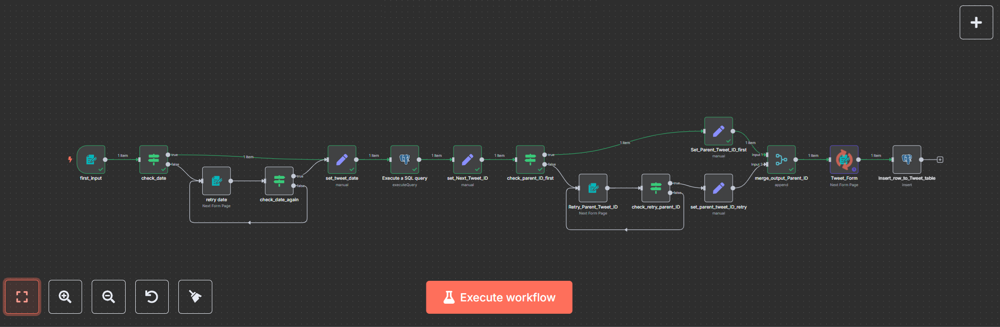
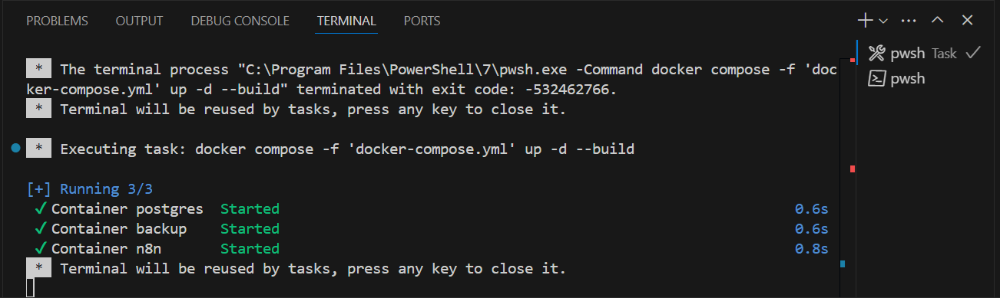
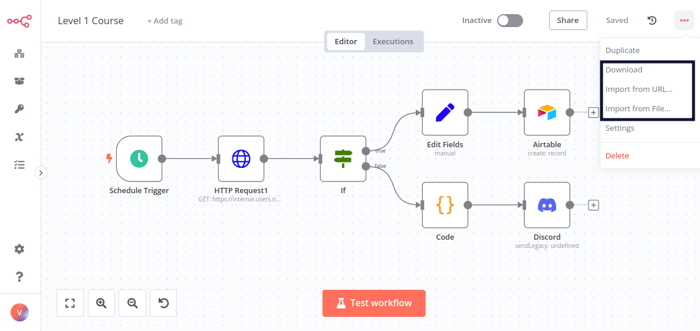
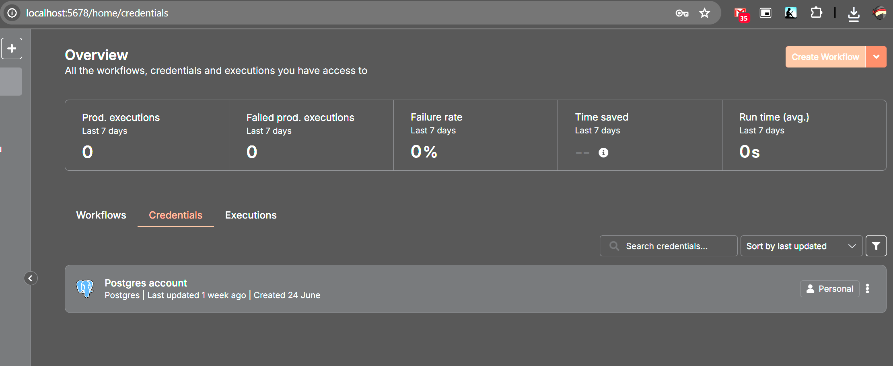
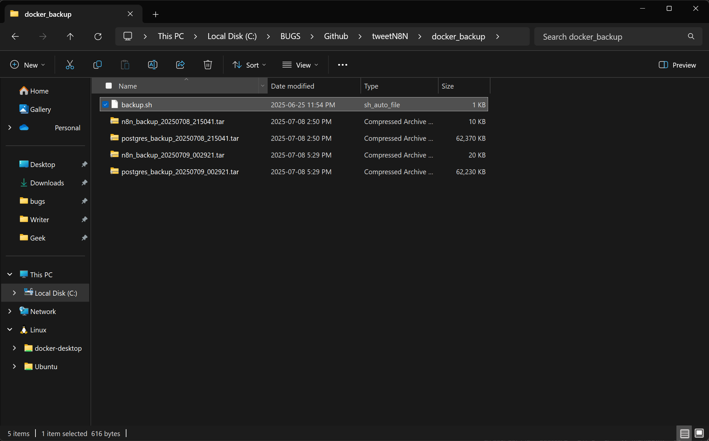
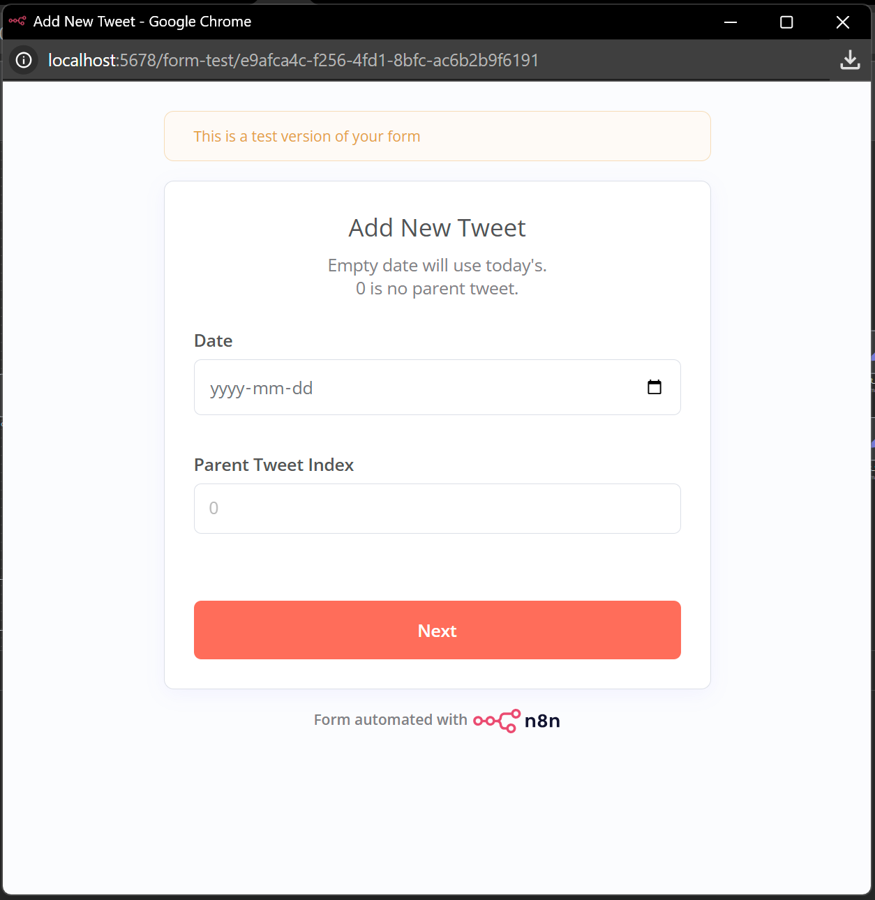
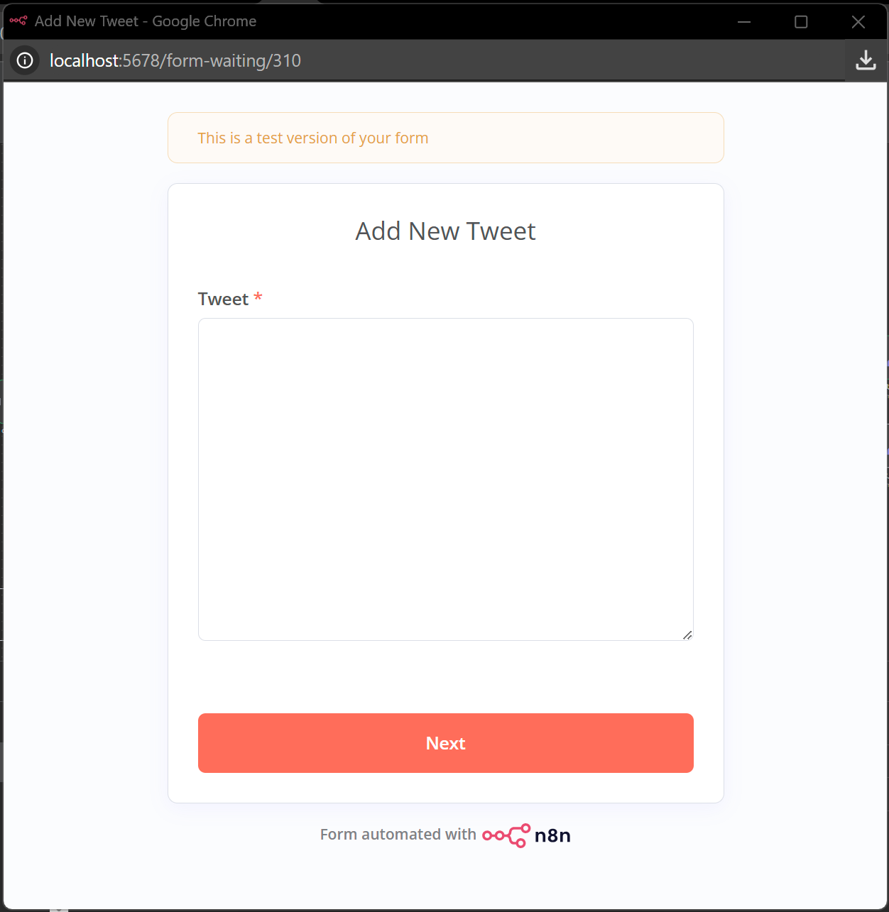
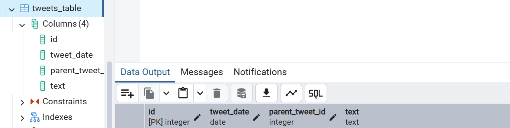
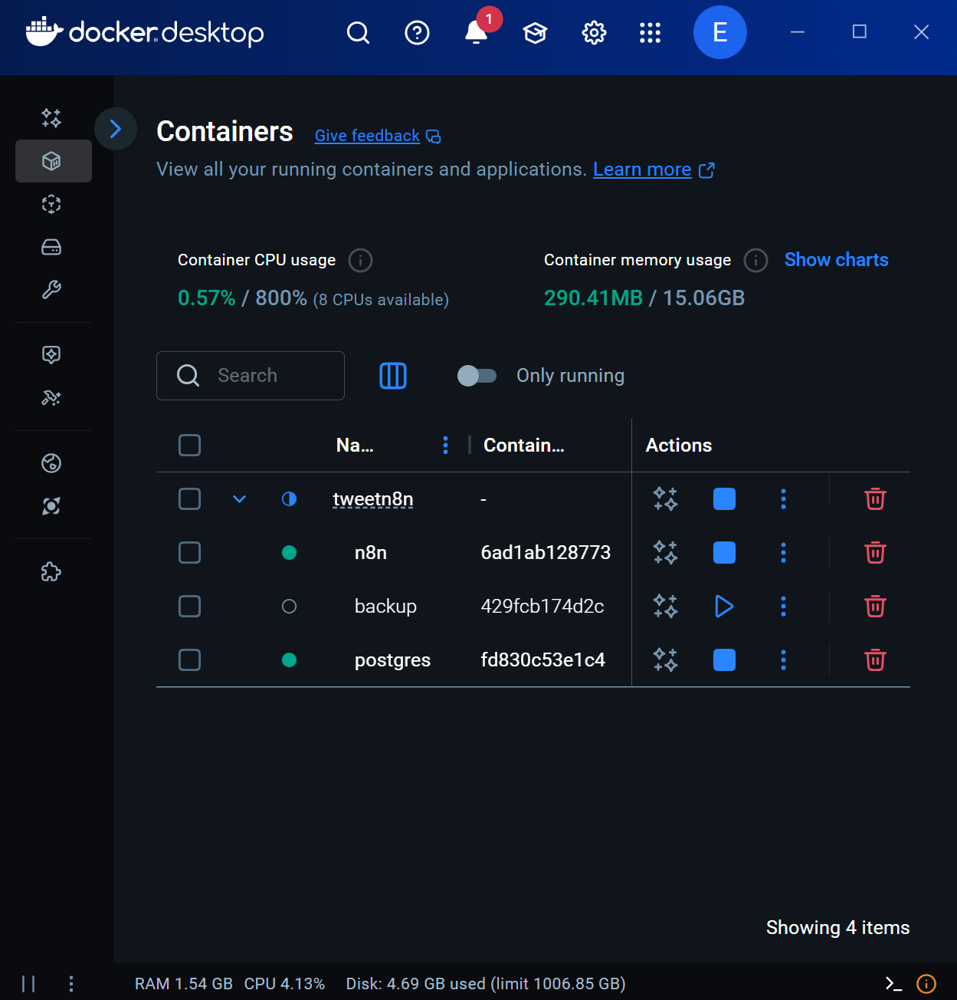
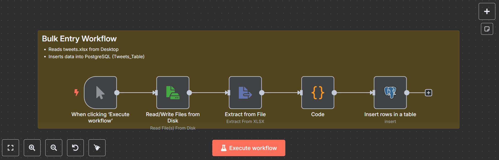

# n8n Tweet Management Workflow with PostgreSQL - Setup Guide

<br>
*Full n8n workflow canvas.*<br><br>  

## Table of Contents
1. [Introduction](#introduction)
2. [Purpose and Features](#purpose-and-features)
3. [Requirements](#requirements)
4. [Installation](#installation)
   - [Option 1: Standalone n8n Installation](#option-1-standalone-n8n-installation)
   - [Option 2: Containerized n8n Installation (Docker)](#option-2-containerized-n8n-installation-docker)
   - [Optional: Docker Compose with Backup (Bonus)](#optional-docker-compose-with-backup)
   - [Importing the Workflow](#importing-the-workflow)
   - [Configuring PostgreSQL Credentials](#configuring-postgresql-credentials)
5. [Backup Process](#backup-process)
   - [Why Backups Are Important](#why-backups-are-important)
   - [How the Backup Service Works](#how-the-backup-service-works)
   - [Restoring from Backups](#restoring-from-backups)
6. [Usage](#usage)
   - [Form Inputs Explained](#form-inputs-explained)
   - [Running the Workflow](#running-the-workflow)
7. [Screenshots](#screenshots)
8. [Troubleshooting](#troubleshooting)
9. [Support and Community](#support-and-community)

## Introduction
This detailed guide provides everything you need to set up and use the n8n Tweet Management Workflow with PostgreSQL, a robust automation tool for managing tweets. Designed for social media managers, developers, and automation enthusiasts, this workflow streamlines tweet scheduling and storage with intuitive forms and PostgreSQL integration. The guide covers standalone and containerized setups, an optional backup system, usage instructions, and troubleshooting tips to ensure a smooth experience.

## Purpose and Features
The n8n Tweet Management Workflow with PostgreSQL offers:
- **Form-Based Input**: Enter tweets, dates, and parent tweet IDs via user-friendly web forms.
- **Data Validation**: Ensures dates are in YYYY-MM-DD format and parent tweet IDs are valid.
- **PostgreSQL Storage**: Saves tweets in a structured database for easy management and analysis.
- **Automation**: Simplifies tweet scheduling and organization for social media campaigns.
- **Flexible Deployment**: Supports standalone n8n or Docker, with optional backups for data protection.
- **Backup System**: Automatically backs up database and n8n data, retaining the latest two backups.

This workflow is ideal for automating repetitive tasks, maintaining data consistency, and creating a reliable tweet archive.

## Requirements
- **n8n**: Version 1.0 or higher
- **PostgreSQL**: Version 12 or higher with a `tweets_table` containing:
  - Columns: `id` (integer, primary key), `tweet_date` (date), `parent_tweet_id` (integer), `text` (text)
- **System**:
  - For standalone: Node.js (v16 or higher), npm
  - For containerized: Docker, Docker Compose
- **Optional for Backup**: Ubuntu image, backup script (included in Docker Compose section)
- **Basic Knowledge**: Familiarity with n8n workflows, PostgreSQL, and Docker (for containerized setup)
- **Optional Tools**: PostgreSQL client (e.g., pgAdmin, DBeaver) for database management

## Installation
This section provides multiple installation options to accommodate your environment.

### Option 1: Standalone n8n Installation
Ideal for users running n8n directly on their machine without containers.

1. **Install Node.js**:
   - Download and install Node.js (v16 or higher) from [nodejs.org](https://nodejs.org).
   - Verify in a terminal:
     ```bash
     node --version
     npm --version
     ```

2. **Install n8n**:
   - Install globally:
     ```bash
     npm install n8n -g
     ```
   - Start n8n:
     ```bash
     n8n start
     ```
   - Access at `http://localhost:5678`.

3. **Set Up PostgreSQL**:
   - Install PostgreSQL from [postgresql.org/download](https://www.postgresql.org/download/).
   - Create a database (e.g., `tweet_db`):
     ```sql
     CREATE DATABASE tweet_db;
     ```
   - Create the `tweets_table`:
     ```sql
     CREATE TABLE tweets_table (
         id INTEGER PRIMARY KEY,
         tweet_date DATE,
         parent_tweet_id INTEGER,
         text TEXT
     );
     ```
   - Note your database credentials for later.

### Option 2: Containerized n8n Installation (Docker)
Uses Docker for a portable, isolated environment, suitable for production or testing.

1. **Install Docker**:
   - Download and install Docker from [docker.com/get-started](https://www.docker.com/get-started).
   - Verify:
     ```bash
     docker --version
     ```

2. **Run n8n and PostgreSQL**:
   - Create a `docker-compose.yml` file:
     ```yaml
     version: '3'
     services:
       n8n:
         image: n8nio/n8n:latest
         ports:
           - '5678:5678'
         volumes:
           - n8n_data:/home/node/.n8n
         environment:
           - N8N_HOST=localhost
           - N8N_PORT=5678
       postgres:
         image: postgres:14
         environment:
           - POSTGRES_DB=tweet_db
           - POSTGRES_USER=your_user
           - POSTGRES_PASSWORD=your_secure_password
         volumes:
           - postgres_data:/var/lib/postgresql/data
         ports:
           - '5432:5432'
     volumes:
       n8n_data:
       postgres_data:
     ```
   - Run:
     ```bash
     docker-compose up -d
     ```
   - Access n8n at `http://localhost:5678`.

3. **Set Up PostgreSQL Table**:
   - Connect to PostgreSQL:
     ```bash
     docker exec -it <postgres_container_name> psql -U your_user -d tweet_db
     ```
   - Create the `tweets_table`:
     ```sql
     CREATE TABLE tweets_table (
         id INTEGER PRIMARY KEY,
         tweet_date DATE,
         parent_tweet_id INTEGER,
         text TEXT
     );
     ```

### Optional: Docker Compose with Backup
### (Bonus)
This setup includes n8n, PostgreSQL, and a backup service for data protection. Replace placeholders with your values.

```yaml
version: '3.8'
services:
  postgres:
    image: postgres:latest
    container_name: postgres
    restart: unless-stopped
    environment:
      POSTGRES_USER: your_user
      POSTGRES_PASSWORD: your_secure_password
      POSTGRES_DB: tweet_db
    ports:
      - '5432:5432'
    volumes:
      - postgres_data:/var/lib/postgresql/data
    networks:
      - n8n-network
  n8n:
    image: n8nio/n8n:latest
    container_name: n8n
    restart: unless-stopped
    environment:
      DB_TYPE: postgresdb
      DB_POSTGRESDB_HOST: postgres
      DB_POSTGRESDB_PORT: 5432
      DB_POSTGRESDB_DATABASE: tweet_db
      DB_POSTGRESDB_USER: your_user
      DB_POSTGRESDB_PASSWORD: your_secure_password
      N8N_HOST: localhost
      N8N_PORT: 5678
      WEBHOOK_URL: http://localhost:5678/
    ports:
      - '5678:5678'
    depends_on:
      - postgres
    volumes:
      - n8n_data:/home/node/.n8n
      - /path/to/your/desktop:/desktop
    networks:
      - n8n-network
  backup:
    image: ubuntu
    container_name: backup
    volumes:
      - postgres_data:/data/postgres
      - n8n_data:/data/n8n
      - /path/to/backup/folder:/backup
    entrypoint: /backup/backup.sh
    networks:
      - n8n-network
volumes:
  postgres_data:
  n8n_data:
networks:
  n8n-network:
```

**Steps**:
1. Save as `docker-compose.yml`.
2. Replace `/path/to/your/desktop` with a local folder for file access in the n8n container.
3. Replace `/path/to/backup/folder` with a local directory for backups.
4. Create a `backup.sh` script in the backup folder: (Bonus)
   ```bash
   #!/bin/bash
   BACKUP_DIR="/backup"
   TIMESTAMP=$(date +%Y%m%d_%H%M%S)
   N8N_BACKUP_FILE="n8n_backup_$TIMESTAMP.tar"
   tar -cvf "$BACKUP_DIR/$N8N_BACKUP_FILE" /data/n8n
   POSTGRES_BACKUP_FILE="postgres_backup_$TIMESTAMP.tar"
   tar -cvf "$BACKUP_DIR/$POSTGRES_BACKUP_FILE" /data/postgres
   cd "$BACKUP_DIR"
   ls -1 n8n_backup_*.tar | sort -r | tail -n +3 | xargs -r rm -f
   ls -1 postgres_backup_*.tar | sort -r | tail -n +3 | xargs -r rm -f
   ```
5. Make executable:
   ```bash
   chmod +x /path/to/backup/folder/backup.sh
   ```
6. Run:
   ```bash
   docker-compose up -d
   ```
7. Check the backup folder for `.tar` files.

<br>
*Screenshot: Docker Compose terminal showing n8n, PostgreSQL, and backup services running.*

### Importing the Workflow
1. Open n8n at `http://localhost:5678`.
2. Go to **Workflows** > **Import from File**.
3. Select `workflow.json` from your purchase package.
4. Save the workflow.

<br>
*Screenshot: n8n import/export menu with `workflow.json` selected for import.*

### Configuring PostgreSQL Credentials
1. In n8n, go to **Credentials** > **Add Credential** > **PostgreSQL**.
2. Enter:
   - **Host**: `postgres` (Docker) or `localhost` (standalone)
   - **Database**: `tweet_db`
   - **User**: `your_user`
   - **Password**: `your_secure_password`
   - **Port**: `5432`
3. Save and assign to `Execute a SQL query` and `Insert_row_to_Tweet_table` nodes.

<br>
*Screenshot: PostgreSQL credentials configured in n8n with correct host, database, user, password, and port.*<br><br>

## Backup Process
The backup system ensures your data is safe and recoverable.

### Why Backups Are Important
Backups protect against:
- **Data Loss**: Hardware failures or accidental deletions.
- **Corruption**: Database or workflow issues.
- **Disaster Recovery**: Quick restoration after crashes or migrations.

### How the Backup Service Works
The backup service uses an Ubuntu container to:
- **Back Up n8n Data**:
  - Archives the `/data/n8n` directory (workflows, credentials) to a `.tar` file (e.g., `n8n_backup_20250708_152700.tar`).
- **Back Up PostgreSQL Data**:
  - Archives the `/data/postgres` directory (database files) to a `.tar` file (e.g., `postgres_backup_20250708_152700.tar`).
- **Retention Policy**:
  - Keeps only the latest two backups for each, deleting older files to save space.
- **Execution**:
  - Runs once at container startup, creating one backup set.
  - To schedule recurring backups, modify `backup.sh` to add a loop (e.g., `while true; do ...; sleep 86400; done` for daily).

Backups are stored in the folder mapped to `/path/to/backup/folder`. Monitor storage to avoid disk issues.

### Restoring from Backups
To restore:
1. **Stop Services**:
   ```bash
   docker-compose down
   ```
2. **Restore PostgreSQL**:
   - Extract the backup:
     ```bash
     tar -xvf /path/to/backup/folder/postgres_backup_20250708_152700.tar -C /tmp/postgres_restore
     ```
   - Copy to the PostgreSQL volume:
     ```bash
     docker cp /tmp/postgres_restore/. <postgres_container_name>:/var/lib/postgresql/data
     ```
3. **Restore n8n Data**:
   - Extract:
     ```bash
     tar -xvf /path/to/backup/folder/n8n_backup_20250708_152700.tar -C /tmp/n8n_restore
     ```
   - Copy:
     ```bash
     docker cp /tmp/n8n_restore/. <n8n_container_name>:/home/node/.n8n
     ```
4. **Restart Services**:
   ```bash
   docker-compose up -d
   ```
5. Verify data in n8n and PostgreSQL.

<br>
*This screenshot shows the backup folder with `.tar` files, confirming successful creation of n8n and PostgreSQL backups.*<br><br>  

## Usage
### Form Inputs Explained
- **Date** (`first_input`, `retry date`):
  - Format: YYYY-MM-DD (e.g., `2025-07-08`)
  - Default: Blank for today’s date
  - Validates format, prompts retry if invalid
- **Parent Tweet Index** (`first_input`, `Retry_Parent_Tweet_ID`):
  - Number (e.g., `1` for reply to tweet ID 1)
  - `0` for standalone tweet
  - Validates ID exists or is `0`
- **Tweet** (`Tweet_Form`):
  - Required text (up to 280 characters)
  - Stored with validated date and parent ID

### Running the Workflow
1. Open the workflow in n8n and activate it.
2. Copy the `first_input` node’s webhook URL.
3. Paste in a browser to access the form.
4. Submit valid data; verify in `tweets_table`:
   ```sql
   SELECT * FROM tweets_table ORDER BY id DESC LIMIT 1;
   ```

<br>
*This screenshot shows the `first_input` form in a browser, confirming the fields for entering date and parent tweet index.*<br><br>  
<br>
*Screenshot of the Tweet Form in a browser. Submitting saves the tweet to the database.*<br><br>  

## Screenshots
- **Workflow Overview**:<br>
<br>
*Full n8n workflow canvas.*<br><br>  
- **Form UI**:<br>
<br>
*`first_input` form in browser.*<br><br>  
- **PostgreSQL Table**:<br>
<br>
*`tweets_table` in pgAdmin/psql.*<br><br>  
- **Docker Setup**:<br>
<br>
*Docker Compose in terminal/Docker Desktop.*<br><br>  
- **Backup Files**:<br>
<br>
*Backup folder with `.tar` files.*<br><br>  
- **Bonus Workflow-Bulk Entry**:<br>
<br>
*If you need it I can give you FREE Bulk Entry Workflow, let me know!*<br><br>  


## Troubleshooting
- **Workflow Import Fails**: Use n8n 1.0+, re-download `workflow.json`.
- **PostgreSQL Errors**: Verify host, user, password, port; check service status.
- **Form Issues**: Use correct date format, valid parent IDs.
- **Backup Fails**: Ensure `backup.sh` is executable, folder is writable.

## Support and Community
- **Community**: [community.n8n.io](https://community.n8n.io).
- **Docs**: [docs.n8n.io](https://docs.n8n.io), [postgresql.org/docs](https://www.postgresql.org/docs).